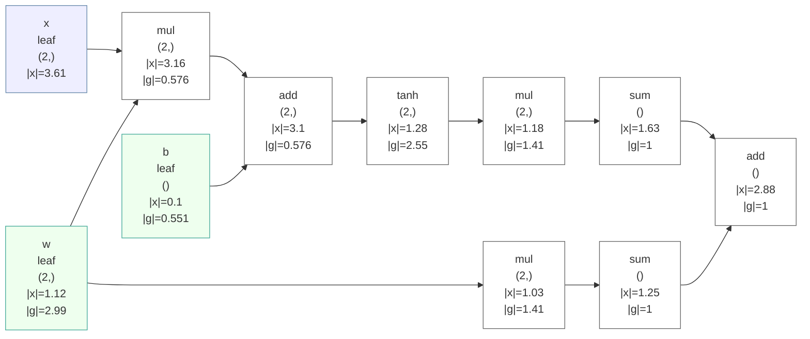

# GradLens 🔬

**A numpy autograd engine with X-ray vision into backpropagation.**

[](.github/workflows/ci.yml)
[](LICENSE)
[](pyproject.toml)
[](tests/)

**English** | [中文](README.zh-CN.md)

Every autodiff framework lets you *run* `backward()`. When your loss goes `nan`,
PyTorch shrugs and micrograd has been spinning for ten minutes on 200 samples.
GradLens is built around a different premise: **the backward pass should be an
observable, debuggable object** — recordable op by op, steppable like a
debugger, checkable against finite differences, drawable without installing
anything, and replayable as an animation.

```python
from gradlens import Tensor, MLP, Tanh, cross_entropy, Adam
from gradlens.debug import debug_backward

model = MLP(2, [32, 32], 3, act=Tanh())
opt = Adam(model.parameters(), lr=0.05)
for epoch in range(200):
    loss = cross_entropy(model(Tensor(X)), y)
    opt.zero_grad()
    loss.backward()
    opt.step()

trace = debug_backward(loss)   # the whole backward pass, op by op
print(trace.report())
```

## Why GradLens?

We love [micrograd](https://github.com/karpathy/micrograd) — it is the best way
to *understand* autodiff, and GradLens is squarely in its lineage (a readable,
~1000-line engine you can read in one sitting). But the educational-framework
niche has a blind spot:

| pain | in existing tools | GradLens |
|---|---|---|
| scalar-only graphs are slow | micrograd: one Python object per scalar | **numpy-vectorized** ops with full broadcasting — ~10,000× faster on batch data (see [benchmark](benchmarks/)) |
| `loss = nan` and you're blind | PyTorch's `detect_anomaly` gives a stack trace pointing at the framework | **`debug_backward()`** records every op's gradient and raises `GradientAnomalyError` naming the first op that produced NaN/Inf, with a readable trace |
| you can't *watch* backprop happen | nobody lets you pause mid-backward | **`step_backward()`** — a generator that advances the backward pass **one op at a time** |
| is this gradient even right? | `torch.autograd.gradcheck` exists but is buried | **`gradcheck()`** as a first-class teaching tool: one call, readable per-input report |
| graphviz install pain | micrograd's `draw_graph` needs a system Graphviz | graphs export as **Mermaid text** that GitHub/GitLab render natively in ```` ```mermaid ```` fences — zero dependencies |

## The X-ray features

### 1. `debug_backward` — the backward pass as data

```python
>>> trace = debug_backward(loss)
>>> print(trace.report())
step  op           label          shape        |grad|     max|g|     notes
--------------------------------------------------------------------------
0     neg                         ()           1          1
1     div                         ()           1          1
2     sum                         ()           0.01562    0.01562
3     mul                         (64, 2)      0.1768     0.01562
...
7     sum                         (64, 1)      inf        inf        Inf in grad
...
first anomaly: step #7 op=sum -> everything downstream is contaminated
```

When a gradient contains NaN/Inf, `GradientAnomalyError` is raised with this
report attached — the traceback points at *your math*, not at the framework.

### 2. `step_backward` — backprop, one op at a time

```python
for i, node in enumerate(step_backward(loss)):
    print(f"{i:2d}  {node._op:<10} |grad|={np.linalg.norm(node.grad):.4f}")
    # inspect node.data, node.grad here; advance when you're ready
```

Each iteration executes exactly one op's backward closure — walk a classroom
through chain rule, or hunt a bug one op at a time.

### 3. `GradientMonitor` — per-parameter gradient norms across training

```python
mon = GradientMonitor(model)     # installs hooks, no loop changes
for step in range(n):
    loss.backward(); mon.tick(); opt.step()
print(mon.summary())             # last/max |g| per parameter + trend
```

Flags `exploding?` / `vanishing?` next to suspicious gradient norms.

### 4. `gradcheck` — finite differences as the referee

```python
>>> result = gradcheck(lambda t: (t * t).tanh().sum() + t.exp().mean(), x)
gradcheck PASSED
  [PASS] x: max_abs_err=2.5e-09 max_rel_err=3.3e-09
```

Works on any scalar-valued function built from engine ops — including a full
MLP + cross-entropy pipeline (see `examples/04_gradcheck.py`).

### 5. Mermaid graph export — renders on GitHub, no graphviz

```python
save_graph_md(loss, "graph.md", direction="LR")
```

A real graph produced by that call (labels, shapes, value/gradient norms,
NaN nodes flagged red):



`save_graph_html(loss, "graph.html")` produces a self-contained HTML page for
the browser.

### 6. `film_backward` — the backward pass as an animation

The signature feature: record a real backward pass and replay it in any
browser. One HTML file, hand-rolled SVG, **zero dependencies and no server** —
play/pause, single-step, scrub, speed control, keyboard navigation, and a
clickable per-op table. Watch gradients light up the graph node by node; when
a gradient goes NaN/Inf, the culprit node and everything it contaminates glow
red.

```python
from gradlens.film import film_backward

film = film_backward(loss, name="my training step")
film.save_html("film.html")     # open in any browser
```

Live examples (open locally from `docs/`, or host them with GitHub Pages):

- [`docs/demo.html`](docs/demo.html) — a healthy MLP + cross-entropy backward pass
- [`docs/demo_nan.html`](docs/demo_nan.html) — a training run that went NaN; the
  film shows exactly which op broke first

To publish the demos: push the repo, enable **Settings → Pages → deploy from
branch**, and `docs/demo.html` is live at
`https://<user>.github.io/gradlens/demo.html`.

### 7. `load_onnx` — run (and film) real ONNX models

Load an ONNX file into the engine: float initializers become trainable
parameters, and every downstream GradLens feature works on the model as-is —
including Backprop Film of a **real pretrained network**.

```python
from gradlens import load_onnx, Tensor, SGD
from gradlens.nn import cross_entropy
from gradlens.film import film_backward

model = load_onnx("mnist-8.onnx")          # real pretrained LeNet-style CNN
loss = cross_entropy(model(Tensor(x)), y)  # forward through plain engine ops
loss.backward()                            # exact gradients, numpy CPU
film_backward(loss).save_html("film.html") # animate a real CNN's backward pass
```

Verified against **onnxruntime**: mnist-8 logits match to 1.4e-6, gradients
through the loaded graph agree with finite differences, and the fine-tuning
demo drives the loss 2.29 → 0.0017. Supported subset (28 ops): Gemm/MatMul,
Add/Mul/Div/..., Conv (im2col, strides/pads/SAME_*), MaxPool, Softmax
(modern + legacy opset semantics), Reshape/Flatten/Transpose/Concat/
Squeeze/Unsqueeze, ReduceSum/ReduceMean, GlobalAveragePool, and more —
unsupported ops are rejected up front with an explicit list
(`analyze_onnx(path)`), never with a crash mid-graph.

- [`docs/demo_onnx.html`](docs/demo_onnx.html) — Backprop Film through the real mnist-8 CNN
- `pip install gradlens[onnx]` for the optional `onnx` extra

### 8. `export_onnx` — train here, deploy anywhere

The loop closes: models built and trained in GradLens export to standard
ONNX (dynamic batch size), run in onnxruntime, open in Netron, and load back
via `load_onnx`. The spiral demo trains to 99.33% here, exports, scores
**99.33% in onnxruntime with logits matching to 4e-6**, and round-trips
back into GradLens to 2e-6.

```python
from gradlens.onnx_export import export_onnx

export_onnx(model, x[:1], "model.onnx")   # drag into https://netron.app
```

### 9. `GradientMonitor.save_html` — the training gradient audit

The Film shows topology; the audit shows **magnitudes**: per-parameter
gradient-norm sparklines (log scale) across training, the loss curve, and
automatic verdicts — `healthy` / `exploding?` / `vanishing?` / `NaN/Inf!` —
as another zero-dependency single-file HTML.

- [`docs/demo_audit.html`](docs/demo_audit.html) — audit of the spiral training run

### 10. Autodiff puzzles — learn backprop by debugging broken graphs

Five deterministic puzzles, each with one sabotaged gradient (injected via
hooks, forward pass untouched — exactly like real life). `p.diff()` tells you
*which parameters* end up wrong; your job is to find *which backward step*
did it, using `debug_backward`, `step_backward`, and `gradcheck`.

```python
from gradlens.puzzles import load_puzzle
p = load_puzzle("p1")          # The Halved Gradient
print(p.story); print(p.diff())
p.check(8)                     # accuse a backward-step index
```

Run `python examples/08_puzzles.py` to watch a detective solve p1: the clean
vs sabotaged traces diverge at exactly one step — the gradient norm is
literally half its true value.

### 11. `gradient_flow` — who eats the gradient?

Backprop distributes gradient like current through a circuit.
``gradient_flow(loss)`` measures the exact mass on every edge (diffing each
parent's gradient around every op's backward) and renders a Sankey-style map:
edge thickness = gradient mass, parameters ranked by their share. This is the
one-glance answer to "why is that layer not learning?" — no other tool draws
this.

```python
from gradlens.flow import gradient_flow

flow = gradient_flow(loss)
print(flow.report())            # parameter shares, ranked
flow.save_html("flow.html")     # Sankey-style map
```

- [`docs/demo_flow.html`](docs/demo_flow.html) — gradient flow of the trained spiral MLP

## Install & quickstart

```bash
pip install -e .            # from a clone; numpy is the only runtime dep
pip install -e .[onnx]      # optional: load/run ONNX models
pytest                      # 131 tests, <1s

python examples/01_getting_started.py
python examples/02_spiral_classifier.py     # 99% acc on 3-class spiral + ASCII boundary
python examples/03_backprop_debugger.py     # step-through + NaN hunting
python examples/04_gradcheck.py
python examples/05_backprop_film.py         # interactive HTML replay of backward
python examples/06_onnx_model.py            # run + fine-tune + film a real ONNX CNN
python examples/07_export_onnx.py            # train here, deploy in onnxruntime
python examples/08_puzzles.py                # hunt sabotaged gradients
```

The engine you'll read in one sitting:

```
gradlens/
├── engine.py       # Tensor + autodiff core (broadcasting, conv2d, maxpool2d, hooks)
├── nn.py           # Linear/MLP/activations, MSE/BCE/cross-entropy, SGD/Adam
├── debug.py        # debug_backward, step_backward, GradientMonitor, anomalies
├── check.py        # finite-difference gradcheck
├── viz.py          # Mermaid/HTML graph export
├── film.py         # Backprop Film: record + replay backward as animation
└── onnx_loader.py  # run ONNX models as GradLens graphs (optional extra)
```

## Benchmark vs micrograd (honest numbers)

Same 2-16-16-1 ReLU MLP, same init, same MSE loss, same full-batch SGD, 200
samples, 50 steps (`benchmarks/bench_vs_micrograd.py`, Windows, Python 3.12):

```
gradlens : 50 steps in   0.009s   final loss 0.0737
micrograd: 50 steps in 106.599s   final loss 0.0737

speedup  :  11711.0x   (same net, same init, same optimizer)
note: identical final losses -- both engines compute identical math
```

The identical final loss is the point: vectorization changes the *speed*,
not the *math* — and the identical numbers cross-validate the engine. This
benchmark is a small net on CPU; the ratio grows with batch size. micrograd
remains the purer minimal engine (GradLens trades ~100 lines for numpy ops,
hooks and tracing); use each for what it's good at.

## Where GradLens sits

| | [micrograd](https://github.com/karpathy/micrograd) | [autograd](https://github.com/HIPS/autograd) | [tinygrad](https://github.com/tinygrad/tinygrad) | PyTorch | **GradLens** |
|---|---|---|---|---|---|
| array-valued tensors | ✗ (scalar) | ✓ | ✓ | ✓ | ✓ |
| lines of core code (readable in one sitting) | ~150 | ~3k | ~10k+ | huge | **~1.9k** |
| backward-pass trace / step debugger | ✗ | ✗ | ✗ | ✗ | ✓ |
| animated backward-pass replay | ✗ | ✗ | ✗ | ✗ | ✓ |
| load & fine-tune ONNX models | ✗ | ✗ | ✗ | ✓ | ✓ (verified vs onnxruntime) |
| first-anomaly NaN location | ✗ | ✗ | ✗ | stack trace | ✓ |
| gradcheck | ✗ | ✓ (buried) | ✓ | ✓ (internal) | ✓ (first-class) |
| graph export | graphviz | ✗ | ✗ | tensorboard | ✓ Mermaid (GitHub-native) |
| production training | ✗ | ✗ (archived) | ✓ | ✓ | ✗ (by design) |

## Roadmap

- [x] ~~`trace.save("film.json")` — replayable backward passes~~ → **Backprop Film** (`gradlens.film`)
- [x] ~~ONNX interop~~ → **`gradlens.onnx_loader`** (run + fine-tune + film ONNX models)
- [ ] a Jupyter magic: `%%gradlens` renders the graph inline
- [x] ~~GradLens → ONNX export (train here, deploy anywhere)~~ → **`gradlens.onnx_export`**
- [x] ~~autodiff puzzle set (teach backprop by debugging broken graphs)~~ → **`gradlens.puzzles`** (5 puzzles)

## Contributing

Issues and PRs welcome — small, readable, tested. Run `pytest` before
submitting; new ops must pass a `gradcheck` test.

## License

[MIT](LICENSE)
