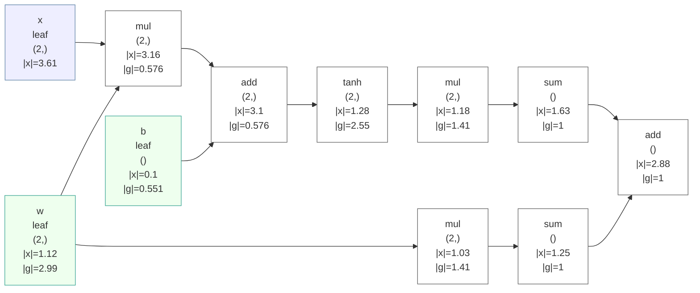

# GradLens 🔬

**一个能"透视"反向传播的 numpy 自动微分引擎。**

[](.github/workflows/ci.yml)
[](LICENSE)
[](pyproject.toml)
[](tests/)

[English](README.md) | **中文**

在线演示（GitHub Pages）：[反传影片](https://zhengqiuyang.github.io/gradlens/demo.html) ·
[真实 ONNX CNN 的反传](https://zhengqiuyang.github.io/gradlens/demo_onnx.html) ·
[NaN 追凶](https://zhengqiuyang.github.io/gradlens/demo_nan.html) ·
[梯度审计](https://zhengqiuyang.github.io/gradlens/demo_audit.html) ·
[梯度流](https://zhengqiuyang.github.io/gradlens/demo_flow.html)


所有自动微分框架都让你*执行* `backward()`。但当 loss 变成 `nan` 时，
PyTorch 只会耸耸肩，micrograd 还在 200 个样本上转第十分钟。GradLens 的立意不同：
**反向传播本身应该是可观测、可调试的对象** —— 可以逐算子记录、像调试器一样单步执行、
用有限差分校验、零依赖地画出来，还能像动画一样回放。

```python
from gradlens import Tensor, MLP, Tanh, cross_entropy, Adam
from gradlens.debug import debug_backward

model = MLP(2, [32, 32], 3, act=Tanh())
opt = Adam(model.parameters(), lr=0.05)
for epoch in range(200):
    loss = cross_entropy(model(Tensor(X)), y)
    opt.zero_grad()
    loss.backward()
    opt.step()

trace = debug_backward(loss)   # 整个反向传播过程，逐算子记录
print(trace.report())
```

## 为什么做 GradLens？

我们热爱 [micrograd](https://github.com/karpathy/micrograd) —— 它是*理解*自动微分的最佳途径，
GradLens 正是它的血脉延续（一个 ~1000 行、一次就能读完的引擎）。但教学级框架这个生态位有个盲区：

| 痛点 | 现有工具 | GradLens |
|---|---|---|
| 纯标量图太慢 | micrograd：每个标量一个 Python 对象 | **numpy 向量化**算子 + 完整广播支持 —— 批量数据快约 4 个数量级（见[基准](benchmarks/)） |
| `loss = nan` 两眼一抹黑 | PyTorch 的 `detect_anomaly` 给的是指向框架的堆栈 | **`debug_backward()`** 记录每个算子的梯度，抛出 `GradientAnomalyError` 并指明第一个产生 NaN/Inf 的算子，附完整可读报告 |
| 反传过程看不到 | 没有框架能暂停反向传播 | **`step_backward()`** —— 生成器让反向传播**一次前进一个算子** |
| 这个梯度到底对不对？ | `torch.autograd.gradcheck` 存在但藏在内部 | **`gradcheck()`** 是一等公民教学工具：一次调用，按输入给出可读报告 |
| graphviz 安装之痛 | micrograd 的 `draw_graph` 需要系统装 Graphviz | 计算图导出为 **Mermaid 文本**，GitHub/GitLab 在 ```` ```mermaid ```` 围栏里原生渲染 —— 零依赖 |

## X 光功能一览

### 1. `debug_backward` —— 反向传播变成数据

```python
>>> trace = debug_backward(loss)
>>> print(trace.report())
step  op           label          shape        |grad|     max|g|     notes
--------------------------------------------------------------------------
0     neg                         ()           1          1
1     div                         ()           1          1
2     sum                         ()           0.01562    0.01562
3     mul                         (64, 2)      0.1768     0.01562
...
7     sum                         (64, 1)      inf        inf        Inf in grad
...
first anomaly: step #7 op=sum -> everything downstream is contaminated
```

梯度一旦含 NaN/Inf，`GradientAnomalyError` 携带上述报告抛出 —— 报告指向*你的数学*，而不是框架内部。

### 2. `step_backward` —— 反传单步调试

```python
for i, node in enumerate(step_backward(loss)):
    print(f"{i:2d}  {node._op:<10} |grad|={np.linalg.norm(node.grad):.4f}")
    # 在这里检查 node.data、node.grad；看完再前进
```

每次迭代恰好执行一个算子的反向闭包 —— 给学生演示链式法则，或逐算子抓 bug。

### 3. `GradientMonitor` —— 训练全程的参数梯度范数

```python
mon = GradientMonitor(model)     # 安装 hooks，不用改训练循环
for step in range(n):
    loss.backward(); mon.tick(); opt.step()
print(mon.summary())             # 每个参数的 last/max |g| 及趋势
```

可疑的梯度范数旁会标注 `exploding?` / `vanishing?`。

### 4. `gradcheck` —— 有限差分当裁判

```python
>>> result = gradcheck(lambda t: (t * t).tanh().sum() + t.exp().mean(), x)
gradcheck PASSED
  [PASS] x: max_abs_err=2.5e-09 max_rel_err=3.3e-09
```

适用于任何由引擎算子构成的标量函数 —— 包括完整 MLP + 交叉熵流水线（见 `examples/04_gradcheck.py`）。

### 5. Mermaid 计算图导出 —— GitHub 原生渲染，无需 graphviz

```python
save_graph_md(loss, "graph.md", direction="LR")
```

这是该调用产出的真实计算图（含标签、形状、数值/梯度范数，NaN 节点标红）：



`save_graph_html(loss, "graph.html")` 会生成浏览器可直接打开的独立 HTML 页面。

### 6. `film_backward` —— 反向传播变成动画 🎬

招牌功能：录制一次真实的反向传播，在任意浏览器里回放。单个 HTML 文件、手绘 SVG、
**零依赖、无需服务器** —— 支持播放/暂停、单步、进度条拖动、倍速、键盘操作，
以及可点击的逐算子表格。看着梯度把计算图逐节点"点亮"；梯度一旦变 NaN/Inf，
肇事节点和它污染的所有节点会亮起红色。

```python
from gradlens.film import film_backward

film = film_backward(loss, name="my training step")
film.save_html("film.html")     # 用任意浏览器打开
```

在线示例（本地直接打开 `docs/` 下的文件，或用 GitHub Pages 托管）：

- [`docs/demo.html`](docs/demo.html) —— 正常的 MLP + 交叉熵反向传播
- [`docs/demo_nan.html`](docs/demo_nan.html) —— 一次训练爆炸现场，影片会指出第一个出错的算子

发布 demo 的方法：推送仓库后，在 **Settings → Pages → deploy from branch** 打开，
`docs/demo.html` 就在 `https://<user>.github.io/gradlens/demo.html` 上线了。

### 7. `load_onnx` —— 加载（并"放映"）真实的 ONNX 模型

把 ONNX 文件加载进引擎：浮点初始化权重自动变成可训练参数，GradLens 的
全部能力对模型即刻生效——包括给**真实预训练网络**的反传放影片。

```python
from gradlens import load_onnx, Tensor, SGD
from gradlens.nn import cross_entropy
from gradlens.film import film_backward

model = load_onnx("mnist-8.onnx")          # 真实预训练的 LeNet 式 CNN
loss = cross_entropy(model(Tensor(x)), y)  # 前向 = 纯引擎算子
loss.backward()                            # 精确梯度，numpy CPU
film_backward(loss).save_html("film.html") # 给真实 CNN 的反传放动画
```

**与 onnxruntime 交叉验证**：mnist-8 的 logits 最大差 1.4e-6；加载图的梯度与
有限差分一致；微调示例把 loss 从 2.29 降到 0.0017。支持 28 个算子：
Gemm/MatMul、Add/Mul/Div/…、Conv（im2col，strides/pads/SAME_*）、MaxPool、
Softmax（新/旧 opset 语义都支持）、Reshape/Flatten/Transpose/Concat/
Squeeze/Unsqueeze、ReduceSum/ReduceMean、GlobalAveragePool 等——不支持的算子
会在加载时就明确报出来（`analyze_onnx(path)`），绝不让程序在图中间崩溃。

- [`docs/demo_onnx.html`](docs/demo_onnx.html) —— 真实 mnist-8 CNN 的反传影片
- `pip install gradlens[onnx]` 安装可选的 onnx 依赖

### 8. `export_onnx` —— 此处训练，随处部署

闭环完成：在 GradLens 里搭建并训练的模型可以导出为标准 ONNX（动态 batch），
在 onnxruntime 里运行、在 Netron 里打开、再用 `load_onnx` 装回 GradLens。
螺旋分类示例在此训练到 99.33%，导出后 **onnxruntime 同样 99.33%、logits 相差
4e-6**，装回 GradLens 相差 2e-6。

```python
from gradlens.onnx_export import export_onnx

export_onnx(model, x[:1], "model.onnx")   # 拖进 https://netron.app 看结构
```

### 9. `GradientMonitor.save_html` —— 训练梯度审计报告

影片看的是拓扑，审计看的是**幅度**：每个参数全程梯度范数的对数刻度
sparkline、loss 曲线、自动判定 healthy / exploding? / vanishing? / NaN/Inf! ——
依然是零依赖单文件 HTML。

- [`docs/demo_audit.html`](docs/demo_audit.html) —— 螺旋分类训练的审计报告

### 10. 自动微分谜题集 —— 通过"破案"学反传

五个确定性谜题，每个都藏着一处被污染的梯度（用 hooks 注入，前向完全正常——
和真实生活一样）。`p.diff()` 告诉你*哪些参数*的梯度错了；你的任务是用
`debug_backward`、`step_backward`、`gradcheck` 找出*哪一步反传*动的手。

```python
from gradlens.puzzles import load_puzzle
p = load_puzzle("p1")          # The Halved Gradient（减半泄漏）
print(p.story); print(p.diff())
p.check(8)                     # 指认一个反传步的编号
```

运行 `python examples/08_puzzles.py` 可以看侦探怎么破 p1：干净与被污染的
反传轨迹在恰好一步分叉——那里的梯度范数 literally 是真值的一半。

### 11. `gradient_flow` —— 梯度都被谁吃掉了？

反传像电流一样在图里分配梯度。`gradient_flow(loss)` 逐边测量精确的梯度
质量（在每个算子反传前后对父节点梯度做差分），渲染成 Sankey 风格的流向图：
边越粗 = 梯度质量越大，参数按所得份额排名。这是"这一层为什么学不动"的
一眼答案 —— 没有其他工具画这张图。

```python
from gradlens.flow import gradient_flow

flow = gradient_flow(loss)
print(flow.report())            # 参数份额排名
flow.save_html("flow.html")     # Sankey 风格流向图
```

- [`docs/demo_flow.html`](docs/demo_flow.html) —— 训练好的螺旋 MLP 的梯度流

## 安装与快速上手

```bash
pip install -e .            # 克隆后本地安装；运行时唯一依赖是 numpy
pip install -e .[onnx]      # 可选：加载/运行 ONNX 模型
pytest                      # 131 个测试，<1 秒

python examples/01_getting_started.py
python examples/02_spiral_classifier.py     # 三分类螺旋 99% 准确率 + ASCII 决策边界
python examples/03_backprop_debugger.py     # 单步反传 + NaN 追凶
python examples/04_gradcheck.py
python examples/05_backprop_film.py         # 反向传播动画回放（HTML）
python examples/06_onnx_model.py            # 运行 + 微调 + 放映真实 ONNX CNN
python examples/07_export_onnx.py            # 此处训练，onnxruntime 里部署
python examples/08_puzzles.py                # 追查被污染的梯度
```

一次就能读完的引擎：

```
gradlens/
├── engine.py       # Tensor + 自动微分核心（广播、conv2d、maxpool2d、hooks）
├── nn.py           # Linear/MLP/激活函数，MSE/BCE/交叉熵，SGD/Adam
├── debug.py        # debug_backward、step_backward、GradientMonitor、异常定位
├── check.py        # 有限差分 gradcheck
├── viz.py          # Mermaid/HTML 计算图导出
├── film.py         # 反传影片：录制 + 动画回放
├── onnx_loader.py  # ONNX 模型 → GradLens 计算图（可选依赖）
├── onnx_export.py   # GradLens 模型 → ONNX（此处训练，随处部署）
├── puzzles.py       # 自动微分谜题：破案学反传
└── flow.py          # 梯度流：谁吃掉了梯度（Sankey HTML）
```

## 与 micrograd 的基准对比（诚实数字）

完全相同的 2-16-16-1 ReLU MLP、相同初始化、相同 MSE 损失、相同全批 SGD，200 样本 50 步
（`benchmarks/bench_vs_micrograd.py`，Windows，Python 3.12）：

```
gradlens : 50 steps in   0.009s   final loss 0.0737
micrograd: 50 steps in 106.599s   final loss 0.0737

speedup  :  11711.0x   (same net, same init, same optimizer)
note: identical final losses -- both engines compute identical math
```

最终 loss 完全一致才是重点：向量化改变的是*速度*而非*数学* —— 一致的数字也是引擎的交叉验证。
该基准是小网络 CPU 场景，批越大差距越大。micrograd 仍是更纯粹的最小引擎
（GradLens 用约 100 行换来了 numpy 算子、hooks 与追踪能力），各取所长。

## GradLens 的定位

| | [micrograd](https://github.com/karpathy/micrograd) | [autograd](https://github.com/HIPS/autograd) | [tinygrad](https://github.com/tinygrad/tinygrad) | PyTorch | **GradLens** |
|---|---|---|---|---|---|
| 数组张量 | ✗（标量） | ✓ | ✓ | ✓ | ✓ |
| 核心代码行数（一次读完） | ~150 | ~3k | ~10k+ | 巨大 | **~1.9k** |
| 反传追踪 / 单步调试器 | ✗ | ✗ | ✗ | ✗ | ✓ |
| 反向传播动画回放 | ✗ | ✗ | ✗ | ✗ | ✓ |
| 加载并微调 ONNX 模型 | ✗ | ✗ | ✗ | ✓ | ✓（与 onnxruntime 对齐验证） |
| 首个 NaN 算子定位 | ✗ | ✗ | ✗ | 堆栈 | ✓ |
| gradcheck | ✗ | ✓（藏在内部） | ✓ | ✓（内部） | ✓（一等公民） |
| 计算图导出 | graphviz | ✗ | ✗ | tensorboard | ✓ Mermaid（GitHub 原生） |
| 生产级训练 | ✗ | ✗（已归档） | ✓ | ✓ | ✗（有意为之） |

## 路线图

- [x] ~~`trace.save("film.json")` —— 可回放的反向传播~~ → 已实现 **反传影片**（`gradlens.film`）
- [x] ~~ONNX 互操作~~ → 已实现 **`gradlens.onnx_loader`**（运行 + 微调 + 放映 ONNX 模型）
- [ ] Jupyter magic：`%%gradlens` 内联渲染计算图
- [x] ~~GradLens → ONNX 导出（此处训练，随处部署）~~ → 已实现 **`gradlens.onnx_export`**
- [x] ~~自动微分谜题集（通过调试坏掉的图来学反传）~~ → 已实现 **`gradlens.puzzles`**（5 关）

## 参与贡献

欢迎 issue 和 PR —— 保持小、可读、有测试。提交前跑 `pytest`；新增算子必须附带
`gradcheck` 测试。

## 许可证

[MIT](LICENSE)
